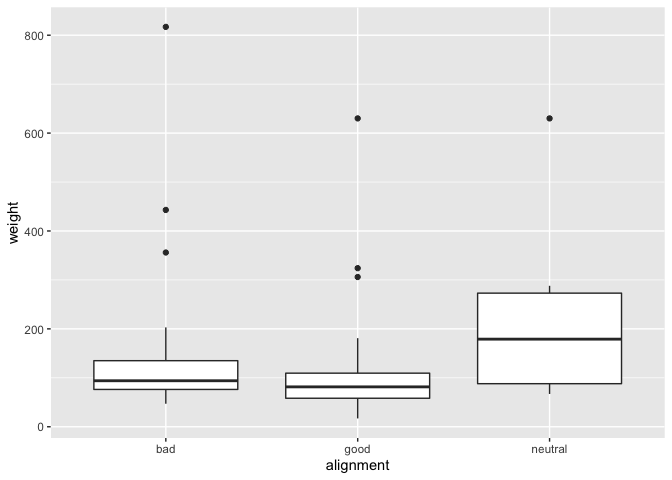
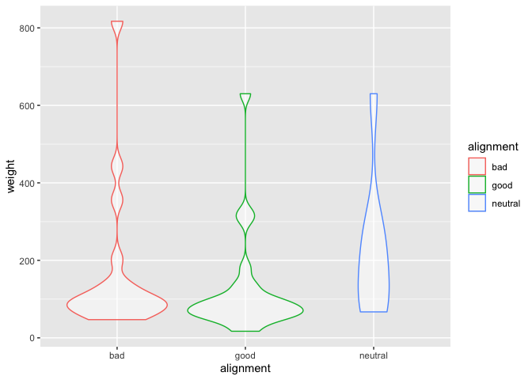
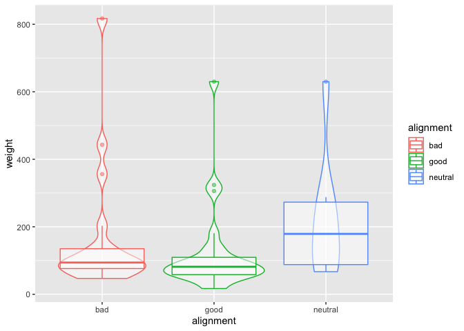
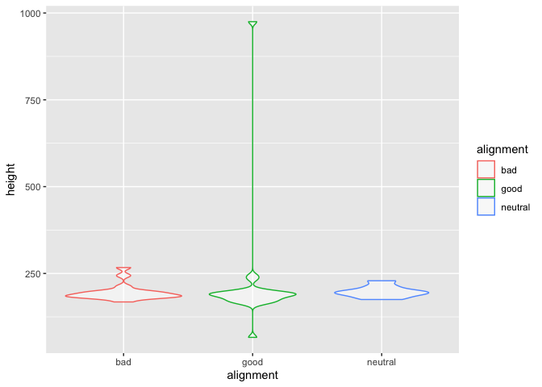
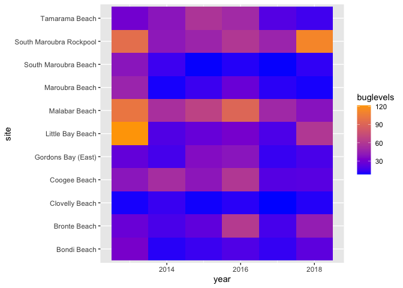
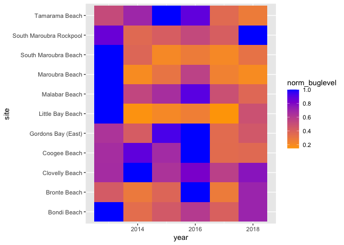
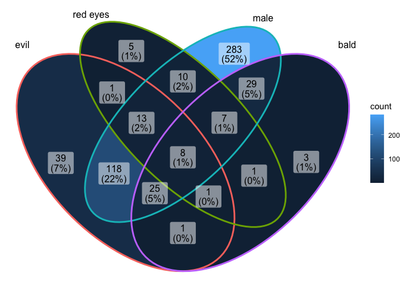
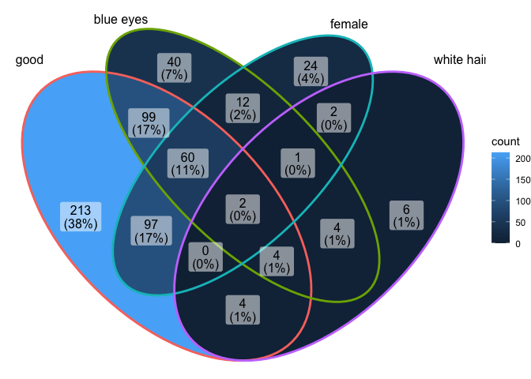
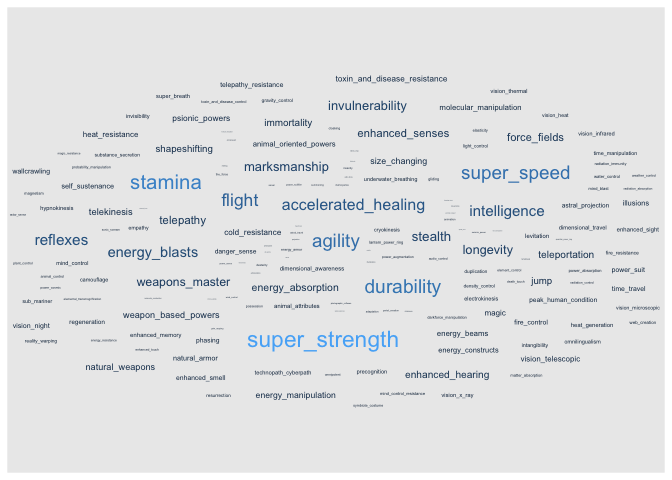
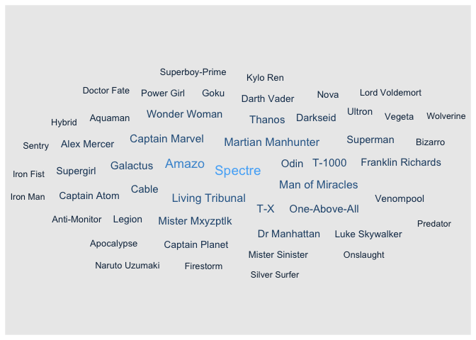

### Load the Libraries

```r
library(tidyverse)
```

```
## ── Attaching packages ─────────────────────────────────────── tidyverse 1.3.1 ──
```

```
## ✓ ggplot2 3.3.5     ✓ purrr   0.3.4
## ✓ tibble  3.1.6     ✓ dplyr   1.0.8
## ✓ tidyr   1.2.0     ✓ stringr 1.4.0
## ✓ readr   2.1.2     ✓ forcats 0.5.1
```

```
## ── Conflicts ────────────────────────────────────────── tidyverse_conflicts() ──
## x dplyr::filter() masks stats::filter()
## x dplyr::lag()    masks stats::lag()
```

```r
library(janitor)
```

```
## 
## Attaching package: 'janitor'
```

```
## The following objects are masked from 'package:stats':
## 
##     chisq.test, fisher.test
```

```r
library("palmerpenguins")


library(ggVennDiagram)
library(RColorBrewer)

#install.packages("ggworldcloud")
library(ggwordcloud)


options(scipen=999) #cancels the use of scientific notation for the session
```


### Data

```r
superhero_info <- readr::read_csv("data/heroes_information.csv", na = c("", "-99", "-"))
```

```
## Rows: 734 Columns: 10
## ── Column specification ────────────────────────────────────────────────────────
## Delimiter: ","
## chr (8): name, Gender, Eye color, Race, Hair color, Publisher, Skin color, A...
## dbl (2): Height, Weight
## 
## ℹ Use `spec()` to retrieve the full column specification for this data.
## ℹ Specify the column types or set `show_col_types = FALSE` to quiet this message.
```

```r
superhero_powers <- readr::read_csv("data/super_hero_powers.csv", na = c("", "-99", "-"))
```

```
## Rows: 667 Columns: 168
## ── Column specification ────────────────────────────────────────────────────────
## Delimiter: ","
## chr   (1): hero_names
## lgl (167): Agility, Accelerated Healing, Lantern Power Ring, Dimensional Awa...
## 
## ℹ Use `spec()` to retrieve the full column specification for this data.
## ℹ Specify the column types or set `show_col_types = FALSE` to quiet this message.
```

```r
beachbugs_long <- readr::read_csv("data/beachbugs_long.csv")
```

```
## Rows: 66 Columns: 3
## ── Column specification ────────────────────────────────────────────────────────
## Delimiter: ","
## chr (1): site
## dbl (2): year, buglevels
## 
## ℹ Use `spec()` to retrieve the full column specification for this data.
## ℹ Specify the column types or set `show_col_types = FALSE` to quiet this message.
```

### 1. 
Clean up the column names (no capitals, not spaces) of `superhero_info`, then use 2 functions to remind yourself of structure of the `superhero_info` data set.


```r
superhero_info <- janitor::clean_names(superhero_info)
superhero_powers <- janitor::clean_names(superhero_powers)
beachbugs_long <- janitor::clean_names(beachbugs_long)
```

### 2.
Are bad guys bigger? Make box-plots of weight by `alignment` (alignment on the x-axis).

```r
superhero_info %>%
  na.exclude() %>% 
  ggplot(aes(alignment, weight))+
  geom_boxplot()
```

<!-- -->

### 3. 
Now, make a violin plot of weight by `alignment` (alignment on the x-axis). Add some color!
  What information can you observe in the violin plot that was not visible in the boxplot?

```r
superhero_info %>%
  na.exclude() %>% 
  ggplot(aes(alignment, weight, color = alignment)) + 
  geom_violin(alpha = .5)
```

<!-- -->


### 4. 
Use `alpha = .5` in `geom_boxplot()` and `geom_violin()` to layer both plots on top of one another. What does this tell you about the distribution of weight in "`bad`" guys?

```r
superhero_info %>%
  na.exclude() %>% 
  ggplot(aes(alignment, weight, color = alignment))+     
  geom_violin(alpha = .5)+
  geom_boxplot(alpha = .5)
```

<!-- -->

```r
#Bad guys appear to have the largest range/distirbution of weight relative to the other groups
```

### 5. 
Box plots are great for showing how the distribution of a numeric variable (e.g. weight) varies among a categorical variable (e.g. alignment).
  Make your own violin plot with the superhero data. 
  What is your numeric data? 
  What is your categorical variable?


```r
superhero_info %>%
  na.exclude() %>% 
  ggplot(aes(alignment, height, color = alignment)) + 
  geom_violin(alpha = .5)
```

<!-- -->

```r
#category = alignment variable = height
```

### 6. 
Remind yourself what `beachbugs` looks like. Then generate a heatmap of buglevels by site and year. 
color it with `scale_fill_gradient(low="yellow", high="red")` or colors of your choice. you may find it looks best with one color!
(dont forget, `coord_flip()` is a quick way to improve the look of your plot if you dont like the default orientation)


```r
glimpse(beachbugs_long)
```

```
## Rows: 66
## Columns: 3
## $ year      <dbl> 2013, 2013, 2013, 2013, 2013, 2013, 2013, 2013, 2013, 2013, …
## $ site      <chr> "Bondi Beach", "Bronte Beach", "Clovelly Beach", "Coogee Bea…
## $ buglevels <dbl> 32.224138, 26.758621, 9.275862, 39.672414, 24.772727, 121.53…
```


```r
beachbugs_long %>%
  ggplot(aes(site, year, fill= buglevels)) + 
  geom_tile() +
  scale_fill_gradient(low="blue", high="orange")+ 
  coord_flip()
```

<!-- -->

### 7.  
Use the provided code to normalize the beachbug data set. 
Then make a heatmap with the `beachbugs_normalized` data, and use the same color chois as above. Which heatmap do you think is more informative? why?


```r
#makes a new column of the highest buglevel observed at each site
beachbugs_w_max <- beachbugs_long %>% 
  group_by(site) %>% 
  mutate(max_buglevel = max(buglevels, na.rm=T)) %>% 
  arrange(site)
beachbugs_w_max
```

```
## # A tibble: 66 × 4
## # Groups:   site [11]
##     year site         buglevels max_buglevel
##    <dbl> <chr>            <dbl>        <dbl>
##  1  2013 Bondi Beach       32.2         32.2
##  2  2014 Bondi Beach       11.1         32.2
##  3  2015 Bondi Beach       14.3         32.2
##  4  2016 Bondi Beach       19.4         32.2
##  5  2017 Bondi Beach       13.2         32.2
##  6  2018 Bondi Beach       22.9         32.2
##  7  2013 Bronte Beach      26.8         61.3
##  8  2014 Bronte Beach      17.5         61.3
##  9  2015 Bronte Beach      23.6         61.3
## 10  2016 Bronte Beach      61.3         61.3
## # … with 56 more rows
```

```r
#makes a new table where the buglevels are normalized to the max_buglevel
beachbugs_normalized <- beachbugs_w_max %>% 
  group_by(site) %>% 
  mutate(norm_buglevel = buglevels/max_buglevel) %>% 
  arrange(site,year) %>%
  select(site, year, norm_buglevel)   # you dont have to select(), but I think its a clearer looking table
beachbugs_normalized
```

```
## # A tibble: 66 × 3
## # Groups:   site [11]
##    site          year norm_buglevel
##    <chr>        <dbl>         <dbl>
##  1 Bondi Beach   2013         1    
##  2 Bondi Beach   2014         0.344
##  3 Bondi Beach   2015         0.445
##  4 Bondi Beach   2016         0.601
##  5 Bondi Beach   2017         0.409
##  6 Bondi Beach   2018         0.710
##  7 Bronte Beach  2013         0.436
##  8 Bronte Beach  2014         0.285
##  9 Bronte Beach  2015         0.385
## 10 Bronte Beach  2016         1    
## # … with 56 more rows
```
 

```r
beachbugs_normalized %>%
  ggplot(aes(site, year, fill= norm_buglevel)) + 
  geom_tile() +
  scale_fill_gradient(low="orange", high="blue")+ 
  coord_flip()
```

<!-- -->

```r
#i think normalized is more informative because i beleive it is showng relative percentage not true count
```

### 8.
Let's make a venn diagram of `superhero_info`, from 4 questions:
Is their alignment evil? 
Are their eyes red?
Are they male?
Are they bald?

Start by making the 4 vectors, then the list of vectors. The vector for alignment is provided:
### super heros venn

```r
# evil

evil_vector <- superhero_info %>%
filter(alignment == "bad") %>%
pull(name)

red_eyevector <- superhero_info %>%
  filter(eye_color == "red")%>%
  pull(name)

malevector <- superhero_info %>%
  filter(gender == "Male")%>%
  pull(name)

baldvector <- superhero_info%>%
  filter(hair_color == "No Hair")%>%
  pull(name)
```


Your list of vectors will look something like this:

```r
 questions_list <- list(evil_vector, red_eyevector, malevector, baldvector)
```

### 9. 
Let's make the venn diagram! use the code from lab as a reference. 

```r
# something like:
 ggVennDiagram( questions_list, category.names = c("evil", "red eyes", "male", "bald"))
```

<!-- -->


### 10. Choose one intersection of the venn diagram that is interesting to you. Use dplyr to find the names of the superheros in that intersection. 


```r
#evil, male, red eyes, but not bald
superhero_info  %>% 
  filter(alignment == "bad" &
           gender == "Male" &
           eye_color == "red" &
           hair_color != "No Hair")
```

```
## # A tibble: 9 × 10
##   name   gender eye_color race  hair_color height publisher skin_color alignment
##   <chr>  <chr>  <chr>     <chr> <chr>       <dbl> <chr>     <chr>      <chr>    
## 1 Apoca… Male   red       Muta… Black         213 Marvel C… grey       bad      
## 2 Black… Male   red       <NA>  Black          NA Marvel C… <NA>       bad      
## 3 Black… Male   red       Demon White         191 Marvel C… white      bad      
## 4 Dooms… Male   red       Alien White         244 DC Comics <NA>       bad      
## 5 Evilh… Male   red       Alien Black         191 Marvel C… green      bad      
## 6 Miste… Male   red       Huma… Black         196 Marvel C… <NA>       bad      
## 7 Omega… Male   red       <NA>  Blond         211 Marvel C… <NA>       bad      
## 8 Stepp… Male   red       New … Black         183 DC Comics white      bad      
## 9 Zoom   Male   red       <NA>  Brown         185 DC Comics <NA>       bad      
## # … with 1 more variable: weight <dbl>
```


### 11. Make another venn diagram with the `superhero_info` data. What are your questions? ( At least 2!) 

```r
good_vector <- superhero_info %>%
filter(alignment == "good") %>%
pull(name)

blue_eyevector <- superhero_info %>%
  filter(eye_color == "blue")%>%
  pull(name)

femalevector <- superhero_info %>%
  filter(gender == "Female")%>%
  pull(name)

whitehairvector <- superhero_info%>%
  filter(hair_color == "White")%>%
  pull(name)
# How many heroes are female and have white hair, how many heroes are Female and have blue eyes
questions_list_2 <- list(good_vector, blue_eyevector, femalevector, whitehairvector)

ggVennDiagram( questions_list_2, category.names = c("good", "blue eyes", "female", "white hair"))
```

<!-- -->


### 12.
What are some very common super powers? Lets make a word cloud with the `superhero_powers` data.

Use the provided code to make the frequency table, then make a word cloud with it. 
Remember, you can change `scale_size_area(max_size = 20)` to a different number if the words wont fit!


```r
head(superhero_powers)
```

```
## # A tibble: 6 × 168
##   hero_names  agility accelerated_healing lantern_power_ring dimensional_awaren…
##   <chr>       <lgl>   <lgl>               <lgl>              <lgl>              
## 1 3-D Man     TRUE    FALSE               FALSE              FALSE              
## 2 A-Bomb      FALSE   TRUE                FALSE              FALSE              
## 3 Abe Sapien  TRUE    TRUE                FALSE              FALSE              
## 4 Abin Sur    FALSE   FALSE               TRUE               FALSE              
## 5 Abomination FALSE   TRUE                FALSE              FALSE              
## 6 Abraxas     FALSE   FALSE               FALSE              TRUE               
## # … with 163 more variables: cold_resistance <lgl>, durability <lgl>,
## #   stealth <lgl>, energy_absorption <lgl>, flight <lgl>, danger_sense <lgl>,
## #   underwater_breathing <lgl>, marksmanship <lgl>, weapons_master <lgl>,
## #   power_augmentation <lgl>, animal_attributes <lgl>, longevity <lgl>,
## #   intelligence <lgl>, super_strength <lgl>, cryokinesis <lgl>,
## #   telepathy <lgl>, energy_armor <lgl>, energy_blasts <lgl>,
## #   duplication <lgl>, size_changing <lgl>, density_control <lgl>, …
```

```r
power_frequency <- superhero_powers %>% 
  select(-hero_names) %>%
  summarise_all(~(sum(.))) %>%
  pivot_longer(everything(), names_to = "power", values_to = "freq")
power_frequency
```

```
## # A tibble: 167 × 2
##    power                  freq
##    <chr>                 <int>
##  1 agility                 242
##  2 accelerated_healing     178
##  3 lantern_power_ring       11
##  4 dimensional_awareness    25
##  5 cold_resistance          47
##  6 durability              257
##  7 stealth                 126
##  8 energy_absorption        77
##  9 flight                  212
## 10 danger_sense             30
## # … with 157 more rows
```


```r
power_frequency %>%
  ggplot(aes(label = power, size = freq, color = freq))+
  geom_text_wordcloud() +
  scale_size_area(max_size = 6) 
```

<!-- -->
### 13.  
Who are some very powerful supers? 
 Lets make a different word cloud with the `superhero_powers` data. 
Use the provided code to make the frequency table, then make a word cloud with it.
You can use `hero_names` for the labels, and `sum_powers` for size. 


```r
power_quantity <- superhero_powers %>% 
  pivot_longer(-hero_names, names_to = "power", values_to = "yes_or_no") %>% 
  group_by(hero_names) %>% 
  mutate(sum_powers = sum(yes_or_no, na.rm=T)) %>%
  arrange(desc(sum_powers), hero_names, desc(yes_or_no))
power_quantity
```

```
## # A tibble: 111,389 × 4
## # Groups:   hero_names [667]
##    hero_names power                 yes_or_no sum_powers
##    <chr>      <chr>                 <lgl>          <int>
##  1 Spectre    agility               TRUE              49
##  2 Spectre    accelerated_healing   TRUE              49
##  3 Spectre    dimensional_awareness TRUE              49
##  4 Spectre    stealth               TRUE              49
##  5 Spectre    energy_absorption     TRUE              49
##  6 Spectre    flight                TRUE              49
##  7 Spectre    marksmanship          TRUE              49
##  8 Spectre    longevity             TRUE              49
##  9 Spectre    intelligence          TRUE              49
## 10 Spectre    super_strength        TRUE              49
## # … with 111,379 more rows
```

```r
#we have to trim down to only the top 50, or it will crowd the image!
power_quantity <- power_quantity %>% 
  ungroup %>%
  distinct(hero_names, sum_powers) %>%
  slice_max(sum_powers, n = 50)
power_quantity
```

```
## # A tibble: 51 × 2
##    hero_names        sum_powers
##    <chr>                  <int>
##  1 Spectre                   49
##  2 Amazo                     44
##  3 Living Tribunal           35
##  4 Martian Manhunter         35
##  5 Man of Miracles           34
##  6 Captain Marvel            33
##  7 T-X                       33
##  8 Galactus                  32
##  9 T-1000                    32
## 10 Mister Mxyzptlk           31
## # … with 41 more rows
```


```r
power_quantity %>%
  ggplot(aes(label = hero_names, size = sum_powers, color = sum_powers))+
  geom_text_wordcloud() +
  scale_size_area(max_size = 5) 
```

<!-- -->

## That's it! 🎉
Thanks for coding with us all winter! 
Now go finish your group project :) 

