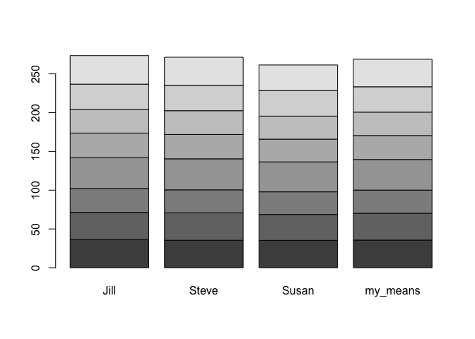

## Instructions
Answer the following questions and complete the exercises in RMarkdown. Please embed all of your code and push your final work to your repository. Your final lab report should be organized, clean, and run free from errors. Remember, you must remove the `#` for the included code chunks to run. Be sure to add your name to the author header above.  

Make sure to use the formatting conventions of RMarkdown to make your report neat and clean!  

1. What is a vector in R?  A 1 dimensional string of data consisting of the same class of data ie. character, numeric, ect.

2. What is a data matrix in R?  A 2 dimensional string of data consisting of the same class of data, like the vector

3. Below are data collected by three scientists (Jill, Steve, Susan in order) measuring temperatures of eight hot springs. Run this code chunk to create the vectors.  

```r
spring_1 <- c(36.25, 35.40, 35.30)
spring_2 <- c(35.15, 35.35, 33.35)
spring_3 <- c(30.70, 29.65, 29.20)
spring_4 <- c(39.70, 40.05, 38.65)
spring_5 <- c(31.85, 31.40, 29.30)
spring_6 <- c(30.20, 30.65, 29.75)
spring_7 <- c(32.90, 32.50, 32.80)
spring_8 <- c(36.80, 36.45, 33.15)
```

4. Build a data matrix that has the springs as rows and the columns as scientists.  

```r
my_matrix <- cbind(spring_1, spring_2, spring_3, spring_4, spring_5, spring_6, spring_7, spring_8)
t(my_matrix)
```

```
##           [,1]  [,2]  [,3]
## spring_1 36.25 35.40 35.30
## spring_2 35.15 35.35 33.35
## spring_3 30.70 29.65 29.20
## spring_4 39.70 40.05 38.65
## spring_5 31.85 31.40 29.30
## spring_6 30.20 30.65 29.75
## spring_7 32.90 32.50 32.80
## spring_8 36.80 36.45 33.15
```

```r
my_matrix.t <- t(my_matrix)
```

5. The names of the springs are 1.Bluebell Spring, 2.Opal Spring, 3.Riverside Spring, 4.Too Hot Spring, 5.Mystery Spring, 6.Emerald Spring, 7.Black Spring, 8.Pearl Spring. Name the rows and columns in the data matrix. Start by making two new vectors with the names, then use `colnames()` and `rownames()` to name the columns and rows.

```r
scientist_names <- c("Jill", "Steve", "Susan")
spring_names <- c("Bluebell", "Opal", "Riverside", "Too_Hot", "Mystery", "Emerald", "Black", "Pearl")
colnames(my_matrix.t) <- scientist_names
rownames(my_matrix.t) <- spring_names
my_matrix.t
```

```
##            Jill Steve Susan
## Bluebell  36.25 35.40 35.30
## Opal      35.15 35.35 33.35
## Riverside 30.70 29.65 29.20
## Too_Hot   39.70 40.05 38.65
## Mystery   31.85 31.40 29.30
## Emerald   30.20 30.65 29.75
## Black     32.90 32.50 32.80
## Pearl     36.80 36.45 33.15
```

6. Calculate the mean temperature of all eight springs.

```r
rowMeans(my_matrix.t)
```

```
##  Bluebell      Opal Riverside   Too_Hot   Mystery   Emerald     Black     Pearl 
##  35.65000  34.61667  29.85000  39.46667  30.85000  30.20000  32.73333  35.46667
```

```r
my_means <- c(35.65000, 34.61667, 29.85000, 39.46667, 30.85000, 30.20000, 32.73333, 35.46667)
my_means.t <- t(my_means)
my_means.t
```

```
##       [,1]     [,2]  [,3]     [,4]  [,5] [,6]     [,7]     [,8]
## [1,] 35.65 34.61667 29.85 39.46667 30.85 30.2 32.73333 35.46667
```

7. Add this as a new column in the data matrix. 

```r
my_matrix_with_means <- cbind(my_matrix.t, my_means)
my_matrix_with_means
```

```
##            Jill Steve Susan my_means
## Bluebell  36.25 35.40 35.30 35.65000
## Opal      35.15 35.35 33.35 34.61667
## Riverside 30.70 29.65 29.20 29.85000
## Too_Hot   39.70 40.05 38.65 39.46667
## Mystery   31.85 31.40 29.30 30.85000
## Emerald   30.20 30.65 29.75 30.20000
## Black     32.90 32.50 32.80 32.73333
## Pearl     36.80 36.45 33.15 35.46667
```

8. Show Susan's value for Opal Spring only.

```r
susans_value_for_opal <- my_matrix_with_means[c("Opal"), c("Susan")]
susans_value_for_opal
```

```
## [1] 33.35
```
9. Calculate the mean for Jill's column only.  

```r
mean(my_matrix_with_means[,1])
```

```
## [1] 34.19375
```

10. Use the data matrix to perform one calculation or operation of your interest.

```r
barplot(my_matrix_with_means)
```

<!-- -->

## Push your final code to GitHub!
Please be sure that you check the `keep md` file in the knit preferences.  
