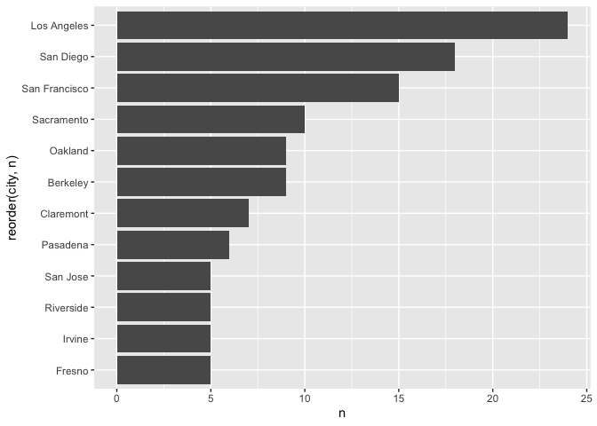
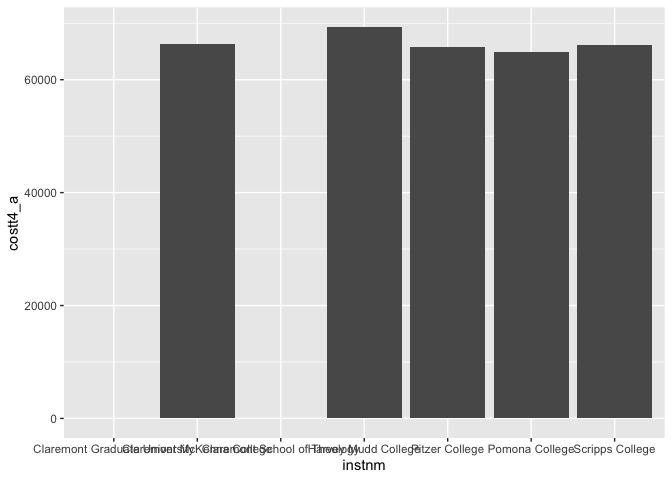
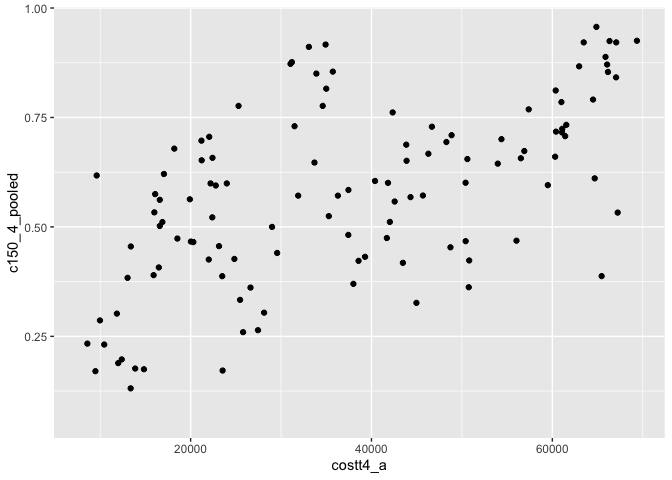
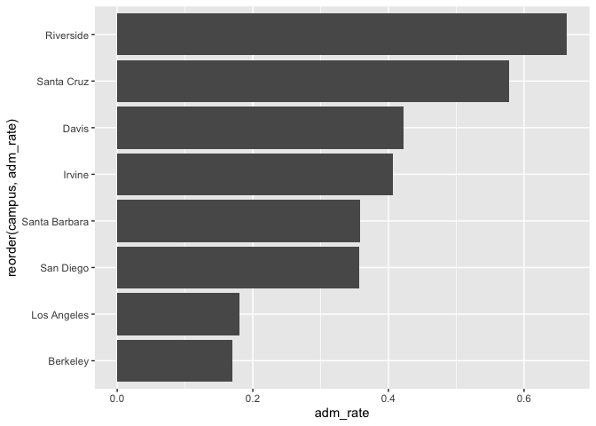
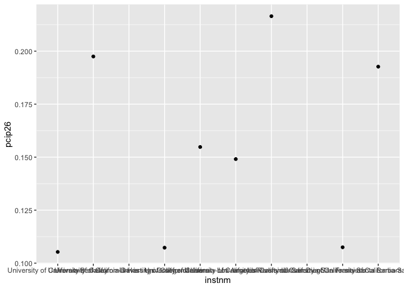

## Instructions
Answer the following questions and complete the exercises in RMarkdown. Please embed all of your code and push your final work to your repository. Your final lab report should be organized, clean, and run free from errors. Remember, you must remove the `#` for the included code chunks to run. Be sure to add your name to the author header above.  

Make sure to use the formatting conventions of RMarkdown to make your report neat and clean!  

## Load the libraries

```r
library(tidyverse)
library(janitor)
library(here)
library(naniar)
library(skimr)
```

For this homework, we will take a departure from biological data and use data about California colleges. These data are a subset of the national college scorecard (https://collegescorecard.ed.gov/data/). Load the `ca_college_data.csv` as a new object called `colleges`.

```r
colleges <- read.csv('~/Midtermbis15/ca_college_data.csv')
```

The variables are a bit hard to decipher, here is a key:  

INSTNM: Institution name  
CITY: California city  
STABBR: Location state  
ZIP: Zip code  
ADM_RATE: Admission rate  
SAT_AVG: SAT average score  
PCIP26: Percentage of degrees awarded in Biological And Biomedical Sciences  
COSTT4_A: Annual cost of attendance  
C150_4_POOLED: 4-year completion rate  
PFTFTUG1_EF: Percentage of undergraduate students who are first-time, full-time degree/certificate-seeking undergraduate students  

1. Use your preferred function(s) to have a look at the data and get an idea of its structure. Make sure you summarize NA's and determine whether or not the data are tidy. You may also consider dealing with any naming issues.

```r
skim(colleges)
```


Table: Data summary

|                         |         |
|:------------------------|:--------|
|Name                     |colleges |
|Number of rows           |341      |
|Number of columns        |10       |
|_______________________  |         |
|Column type frequency:   |         |
|character                |4        |
|numeric                  |6        |
|________________________ |         |
|Group variables          |None     |


**Variable type: character**

|skim_variable | n_missing| complete_rate| min| max| empty| n_unique| whitespace|
|:-------------|---------:|-------------:|---:|---:|-----:|--------:|----------:|
|INSTNM        |         0|             1|  10|  63|     0|      341|          0|
|CITY          |         0|             1|   4|  19|     0|      161|          0|
|STABBR        |         0|             1|   2|   2|     0|        3|          0|
|ZIP           |         0|             1|   5|  10|     0|      324|          0|


**Variable type: numeric**

|skim_variable | n_missing| complete_rate|     mean|       sd|      p0|      p25|      p50|      p75|     p100|hist  |
|:-------------|---------:|-------------:|--------:|--------:|-------:|--------:|--------:|--------:|--------:|:-----|
|ADM_RATE      |       240|          0.30|     0.59|     0.23|    0.08|     0.46|     0.64|     0.75|     1.00|▂▃▆▇▃ |
|SAT_AVG       |       276|          0.19|  1112.31|   170.80|  870.00|   985.00|  1078.00|  1237.00|  1555.00|▇▇▅▂▂ |
|PCIP26        |        35|          0.90|     0.02|     0.04|    0.00|     0.00|     0.00|     0.02|     0.22|▇▁▁▁▁ |
|COSTT4_A      |       124|          0.64| 26685.17| 18122.70| 7956.00| 12578.00| 16591.00| 39289.00| 69355.00|▇▂▂▁▂ |
|C150_4_POOLED |       221|          0.35|     0.57|     0.21|    0.06|     0.43|     0.58|     0.72|     0.96|▂▃▇▇▅ |
|PFTFTUG1_EF   |        53|          0.84|     0.56|     0.29|    0.01|     0.32|     0.50|     0.81|     1.00|▃▇▆▅▇ |

```r
glimpse(colleges)
```

```
## Rows: 341
## Columns: 10
## $ INSTNM        <chr> "Grossmont College", "College of the Sequoias", "College…
## $ CITY          <chr> "El Cajon", "Visalia", "San Mateo", "Ventura", "Oxnard",…
## $ STABBR        <chr> "CA", "CA", "CA", "CA", "CA", "CA", "CA", "CA", "CA", "C…
## $ ZIP           <chr> "92020-1799", "93277-2214", "94402-3784", "93003-3872", …
## $ ADM_RATE      <dbl> NA, NA, NA, NA, NA, NA, NA, NA, NA, NA, NA, NA, NA, NA, …
## $ SAT_AVG       <int> NA, NA, NA, NA, NA, NA, NA, NA, NA, NA, NA, NA, NA, NA, …
## $ PCIP26        <dbl> 0.0016, 0.0066, 0.0038, 0.0035, 0.0085, 0.0151, 0.0000, …
## $ COSTT4_A      <int> 7956, 8109, 8278, 8407, 8516, 8577, 8580, 9181, 9281, 93…
## $ C150_4_POOLED <dbl> NA, NA, NA, NA, NA, NA, 0.2334, NA, NA, NA, NA, 0.1704, …
## $ PFTFTUG1_EF   <dbl> 0.3546, 0.5413, 0.3567, 0.3824, 0.2753, 0.4286, 0.2307, …
```


```r
colleges <- janitor::clean_names(colleges)
```


```r
naniar::miss_var_summary(colleges)
```

```
## # A tibble: 10 × 3
##    variable      n_miss pct_miss
##    <chr>          <int>    <dbl>
##  1 sat_avg          276     80.9
##  2 adm_rate         240     70.4
##  3 c150_4_pooled    221     64.8
##  4 costt4_a         124     36.4
##  5 pftftug1_ef       53     15.5
##  6 pcip26            35     10.3
##  7 instnm             0      0  
##  8 city               0      0  
##  9 stabbr             0      0  
## 10 zip                0      0
```

2. Which cities in California have the highest number of colleges?

```r
colleges %>% 
  count(city) %>% 
  arrange(desc(n))
```

```
##                    city  n
## 1           Los Angeles 24
## 2             San Diego 18
## 3         San Francisco 15
## 4            Sacramento 10
## 5              Berkeley  9
## 6               Oakland  9
## 7             Claremont  7
## 8              Pasadena  6
## 9                Fresno  5
## 10               Irvine  5
## 11            Riverside  5
## 12             San Jose  5
## 13              Anaheim  4
## 14             El Cajon  4
## 15            Fullerton  4
## 16              Redding  4
## 17        Santa Barbara  4
## 18         Santa Monica  4
## 19             Stockton  4
## 20              Alameda  3
## 21          Bakersfield  3
## 22              Hayward  3
## 23              Modesto  3
## 24            Oceanside  3
## 25               Orange  3
## 26               Pomona  3
## 27              Salinas  3
## 28       San Bernardino  3
## 29          Santa Clara  3
## 30           Santa Rosa  3
## 31              Ventura  3
## 32              Visalia  3
## 33             Whittier  3
## 34             Carlsbad  2
## 35               Clovis  2
## 36           Costa Mesa  2
## 37               Eureka  2
## 38         Garden Grove  2
## 39             Glendale  2
## 40            Hollywood  2
## 41     Huntington Beach  2
## 42             La Jolla  2
## 43            Lancaster  2
## 44           Long Beach  2
## 45               Merced  2
## 46             Monterey  2
## 47               Oxnard  2
## 48          Palm Desert  2
## 49            Palo Alto  2
## 50        Pleasant Hill  2
## 51              Rocklin  2
## 52      San Luis Obispo  2
## 53            Santa Ana  2
## 54        Santa Clarita  2
## 55           Santa Cruz  2
## 56          Santa Maria  2
## 57             Van Nuys  2
## 58          West Covina  2
## 59               Angwin  1
## 60                Aptos  1
## 61               Arcata  1
## 62             Atherton  1
## 63                Azusa  1
## 64              Barstow  1
## 65              Belmont  1
## 66            Blue Lake  1
## 67               Blythe  1
## 68              Burbank  1
## 69          Carpinteria  1
## 70               Carson  1
## 71           Chatsworth  1
## 72                Chico  1
## 73          Chula Vista  1
## 74       Citrus Heights  1
## 75             Coalinga  1
## 76               Colton  1
## 77              Compton  1
## 78               Corona  1
## 79          Culver City  1
## 80            Cupertino  1
## 81              Cypress  1
## 82            Daly City  1
## 83                Davis  1
## 84            El Centro  1
## 85             El Monte  1
## 86           Emeryville  1
## 87            Escondido  1
## 88            Fairfield  1
## 89      Fountain Valley  1
## 90              Fremont  1
## 91               Gilroy  1
## 92             Glendora  1
## 93        Granada Hills  1
## 94      Huntington Park  1
## 95             Imperial  1
## 96            Kentfield  1
## 97              La Mesa  1
## 98            La Mirada  1
## 99             La Verne  1
## 100        Laguna Beach  1
## 101          Loma Linda  1
## 102     Los Altos Hills  1
## 103              Malibu  1
## 104          Marysville  1
## 105         Minneapolis  1
## 106       Mission Viejo  1
## 107       Monterey Park  1
## 108            Moorpark  1
## 109              Moraga  1
## 110                Napa  1
## 111       National City  1
## 112       Newport Beach  1
## 113     North Hollywood  1
## 114          Northridge  1
## 115             Norwalk  1
## 116            Oroville  1
## 117           Pittsburg  1
## 118         Porterville  1
## 119              Quincy  1
## 120    Rancho Cucamonga  1
## 121 Rancho Palos Verdes  1
## 122            Redlands  1
## 123       Redondo Beach  1
## 124        Redwood City  1
## 125             Reedley  1
## 126          Ridgecrest  1
## 127        Rohnert Park  1
## 128            Rosemead  1
## 129         San Anselmo  1
## 130           San Bruno  1
## 131           San Dimas  1
## 132         San Jacinto  1
## 133          San Marcos  1
## 134           San Mateo  1
## 135           San Pablo  1
## 136         Santa Paula  1
## 137              Santee  1
## 138            Saratoga  1
## 139              Sonora  1
## 140    South Lake Tahoe  1
## 141          Susanville  1
## 142              Sylmar  1
## 143                Taft  1
## 144             Tarzana  1
## 145               Tempe  1
## 146       Thousand Oaks  1
## 147            Torrance  1
## 148             Turlock  1
## 149               Ukiah  1
## 150              Upland  1
## 151            Valencia  1
## 152             Vallejo  1
## 153         Valley Glen  1
## 154         Victorville  1
## 155               Vista  1
## 156              Walnut  1
## 157         Watsonville  1
## 158                Weed  1
## 159          Wilmington  1
## 160      Woodland Hills  1
## 161             Yucaipa  1
```

3. Based on your answer to #2, make a plot that shows the number of colleges in the top 10 cities.

```r
colleges %>% 
  count(city) %>% 
  top_n(10, n) %>% 
  ggplot(aes(x=reorder(city,n), y=n))+
  geom_col()+
  coord_flip()
```

<!-- -->


4. The column `COSTT4_A` is the annual cost of each institution. Which city has the highest average cost? Where is it located?

```r
colleges %>%
  select(city, costt4_a, instnm) %>%
  group_by(city) %>%
  arrange(desc(costt4_a)) %>%
  head(1)
```

```
## # A tibble: 1 × 3
## # Groups:   city [1]
##   city      costt4_a instnm             
##   <chr>        <int> <chr>              
## 1 Claremont    69355 Harvey Mudd College
```


5. Based on your answer to #4, make a plot that compares the cost of the individual colleges in the most expensive city. Bonus! Add UC Davis here to see how it compares :>).

```r
colleges %>%
  filter(city == 'Claremont') %>%
 ggplot(aes(x=instnm, y=costt4_a))+geom_col()
```

```
## Warning: Removed 2 rows containing missing values (position_stack).
```

<!-- -->

6. The column `ADM_RATE` is the admissions rate by college and `C150_4_POOLED` is the four-year completion rate. Use a scatterplot to show the relationship between these two variables. What do you think this means?

```r
colleges %>% 
  ggplot(aes(x=adm_rate, y=c150_4_pooled)) + geom_point(na.rm=T) 
```

<!-- -->

```r
#higher admission rate lower completion rate
```

7. Is there a relationship between cost and four-year completion rate? (You don't need to do the stats, just produce a plot). What do you think this means?

```r
colleges %>%
   ggplot(aes(x=costt4_a, y=c150_4_pooled)) + geom_point(na.rm=T) 
```

<!-- -->

```r
#higher cost higher the admission rate 
```

8. The column titled `INSTNM` is the institution name. We are only interested in the University of California colleges. Make a new data frame that is restricted to UC institutions. You can remove `Hastings College of Law` and `UC San Francisco` as we are only interested in undergraduate institutions.

```r
univ_calithornia <- colleges %>% 
  filter_all(any_vars(str_detect(., pattern = "University of California")))
univ_calithornia
```

```
##                                              instnm          city stabbr
## 1                University of California-San Diego      La Jolla     CA
## 2                   University of California-Irvine        Irvine     CA
## 3                University of California-Riverside     Riverside     CA
## 4              University of California-Los Angeles   Los Angeles     CA
## 5                    University of California-Davis         Davis     CA
## 6               University of California-Santa Cruz    Santa Cruz     CA
## 7                 University of California-Berkeley      Berkeley     CA
## 8            University of California-Santa Barbara Santa Barbara     CA
## 9  University of California-Hastings College of Law San Francisco     CA
## 10           University of California-San Francisco San Francisco     CA
##           zip adm_rate sat_avg pcip26 costt4_a c150_4_pooled pftftug1_ef
## 1       92093   0.3566    1324 0.2165    31043        0.8724      0.6622
## 2       92697   0.4065    1206 0.1073    31198        0.8764      0.7254
## 3       92521   0.6634    1078 0.1491    31494        0.7300      0.8111
## 4  90095-1405   0.1799    1334 0.1548    33078        0.9112      0.6607
## 5  95616-8678   0.4228    1218 0.1975    33904        0.8502      0.6049
## 6  95064-1011   0.5785    1201 0.1927    34608        0.7764      0.7856
## 7       94720   0.1693    1422 0.1053    34924        0.9165      0.7087
## 8       93106   0.3577    1281 0.1075    34998        0.8157      0.7077
## 9  94102-4978       NA      NA     NA       NA            NA          NA
## 10 94143-0244       NA      NA     NA       NA            NA          NA
```

Remove `Hastings College of Law` and `UC San Francisco` and store the final data frame as a new object `univ_calif_final`.

```r
univ_calithornia_final <- univ_calithornia %>% 
  filter(city!="San Francisco")
univ_calithornia_final
```

```
##                                   instnm          city stabbr        zip
## 1     University of California-San Diego      La Jolla     CA      92093
## 2        University of California-Irvine        Irvine     CA      92697
## 3     University of California-Riverside     Riverside     CA      92521
## 4   University of California-Los Angeles   Los Angeles     CA 90095-1405
## 5         University of California-Davis         Davis     CA 95616-8678
## 6    University of California-Santa Cruz    Santa Cruz     CA 95064-1011
## 7      University of California-Berkeley      Berkeley     CA      94720
## 8 University of California-Santa Barbara Santa Barbara     CA      93106
##   adm_rate sat_avg pcip26 costt4_a c150_4_pooled pftftug1_ef
## 1   0.3566    1324 0.2165    31043        0.8724      0.6622
## 2   0.4065    1206 0.1073    31198        0.8764      0.7254
## 3   0.6634    1078 0.1491    31494        0.7300      0.8111
## 4   0.1799    1334 0.1548    33078        0.9112      0.6607
## 5   0.4228    1218 0.1975    33904        0.8502      0.6049
## 6   0.5785    1201 0.1927    34608        0.7764      0.7856
## 7   0.1693    1422 0.1053    34924        0.9165      0.7087
## 8   0.3577    1281 0.1075    34998        0.8157      0.7077
```

Use `separate()` to separate institution name into two new columns "UNIV" and "CAMPUS".

```r
univ_calithornia_final <- univ_calithornia_final %>% 
  separate(instnm, c("univ", "campus"), sep="-")
univ_calithornia_final
```

```
##                       univ        campus          city stabbr        zip
## 1 University of California     San Diego      La Jolla     CA      92093
## 2 University of California        Irvine        Irvine     CA      92697
## 3 University of California     Riverside     Riverside     CA      92521
## 4 University of California   Los Angeles   Los Angeles     CA 90095-1405
## 5 University of California         Davis         Davis     CA 95616-8678
## 6 University of California    Santa Cruz    Santa Cruz     CA 95064-1011
## 7 University of California      Berkeley      Berkeley     CA      94720
## 8 University of California Santa Barbara Santa Barbara     CA      93106
##   adm_rate sat_avg pcip26 costt4_a c150_4_pooled pftftug1_ef
## 1   0.3566    1324 0.2165    31043        0.8724      0.6622
## 2   0.4065    1206 0.1073    31198        0.8764      0.7254
## 3   0.6634    1078 0.1491    31494        0.7300      0.8111
## 4   0.1799    1334 0.1548    33078        0.9112      0.6607
## 5   0.4228    1218 0.1975    33904        0.8502      0.6049
## 6   0.5785    1201 0.1927    34608        0.7764      0.7856
## 7   0.1693    1422 0.1053    34924        0.9165      0.7087
## 8   0.3577    1281 0.1075    34998        0.8157      0.7077
```

9. The column `ADM_RATE` is the admissions rate by campus. Which UC has the lowest and highest admissions rates? Produce a numerical summary and an appropriate plot.

```r
univ_calithornia %>% 
  filter(grepl('University of California', instnm)) %>%
  arrange(desc(adm_rate))
```

```
##                                              instnm          city stabbr
## 1                University of California-Riverside     Riverside     CA
## 2               University of California-Santa Cruz    Santa Cruz     CA
## 3                    University of California-Davis         Davis     CA
## 4                   University of California-Irvine        Irvine     CA
## 5            University of California-Santa Barbara Santa Barbara     CA
## 6                University of California-San Diego      La Jolla     CA
## 7              University of California-Los Angeles   Los Angeles     CA
## 8                 University of California-Berkeley      Berkeley     CA
## 9  University of California-Hastings College of Law San Francisco     CA
## 10           University of California-San Francisco San Francisco     CA
##           zip adm_rate sat_avg pcip26 costt4_a c150_4_pooled pftftug1_ef
## 1       92521   0.6634    1078 0.1491    31494        0.7300      0.8111
## 2  95064-1011   0.5785    1201 0.1927    34608        0.7764      0.7856
## 3  95616-8678   0.4228    1218 0.1975    33904        0.8502      0.6049
## 4       92697   0.4065    1206 0.1073    31198        0.8764      0.7254
## 5       93106   0.3577    1281 0.1075    34998        0.8157      0.7077
## 6       92093   0.3566    1324 0.2165    31043        0.8724      0.6622
## 7  90095-1405   0.1799    1334 0.1548    33078        0.9112      0.6607
## 8       94720   0.1693    1422 0.1053    34924        0.9165      0.7087
## 9  94102-4978       NA      NA     NA       NA            NA          NA
## 10 94143-0244       NA      NA     NA       NA            NA          NA
```

```r
#Riverside is highest berkley is lowest
```


```r
univ_calithornia_final %>% 
 ggplot(aes(x=reorder(campus, adm_rate), y=adm_rate))+
  geom_col()+
  coord_flip()
```

<!-- -->

10. If you wanted to get a degree in biological or biomedical sciences, which campus confers the majority of these degrees? Produce a numerical summary and an appropriate plot.

```r
univ_calithornia %>% 
  filter(grepl('University of California', instnm)) %>%
  arrange(desc(pcip26)) %>%
  ggplot(aes(x=instnm, y=pcip26)) + geom_point(na.rm=T) 
```

<!-- -->

```r
  #UC SD
```


```r
## Knit Your Output and Post to [GitHub](https://github.com/FRS417-DataScienceBiologists)
```
