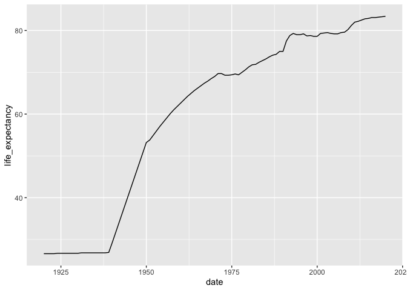
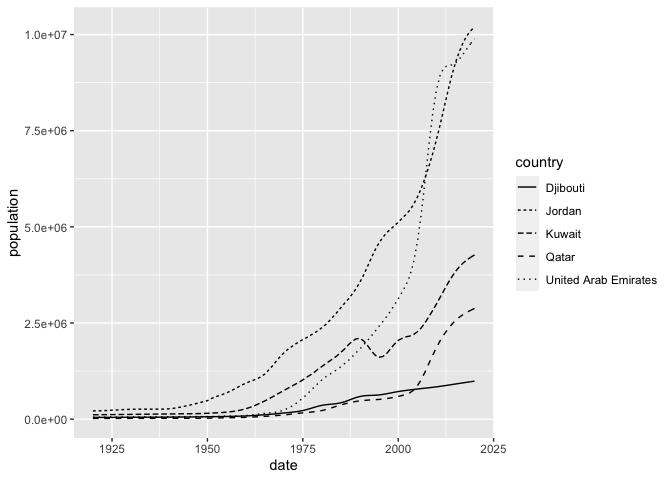
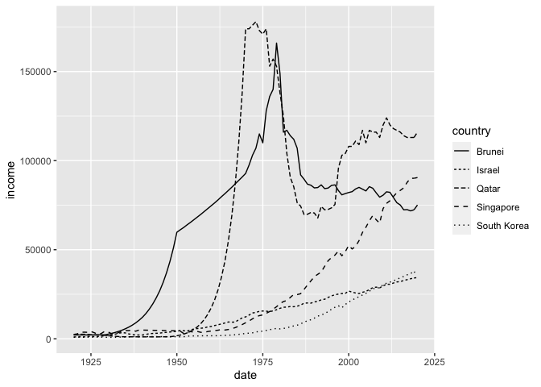
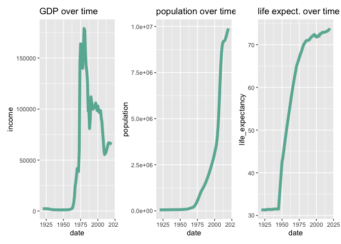

## Instructions
Answer the following questions and complete the exercises in RMarkdown. Please embed all of your code and push your final work to your repository. Your code should be organized, clean, and run free from errors. Be sure to **add your name** to the author header above. You may use any resources to answer these questions (including each other), but you may not post questions to Open Stacks or external help sites. There are 10 total questions.  

Make sure to use the formatting conventions of RMarkdown to make your report neat and clean! Your plots should use consistent aesthetics throughout.  

This exam is due by **12:00p on Tuesday, February 22**.  

## Gapminder
For this assignment, we are going to use data from  [gapminder](https://www.gapminder.org/). Gapminder includes information about economics, population, social issues, and life expectancy from countries all over the world. We will use three data sets, so please load all three as separate objects.    

```r
#load your libraries
library("gapminder")
library(tidyverse)
```

```
## ── Attaching packages ─────────────────────────────────────── tidyverse 1.3.1 ──
```

```
## ✓ ggplot2 3.3.5     ✓ purrr   0.3.4
## ✓ tibble  3.1.6     ✓ dplyr   1.0.8
## ✓ tidyr   1.2.0     ✓ stringr 1.4.0
## ✓ readr   2.1.2     ✓ forcats 0.5.1
```

```
## ── Conflicts ────────────────────────────────────────── tidyverse_conflicts() ──
## x dplyr::filter() masks stats::filter()
## x dplyr::lag()    masks stats::lag()
```

```r
library(janitor)
```

```
## 
## Attaching package: 'janitor'
```

```
## The following objects are masked from 'package:stats':
## 
##     chisq.test, fisher.test
```

```r
library(here)
```

```
## here() starts at /Users/flynnatallah/Documents/GitHub/BIS15W2022_catallah
```

```r
library(naniar)
library(dplyr)
library(ggplot2)
library(patchwork)
```

1. population_total.csv  
2. income_per_person_gdppercapita_ppp_inflation_adjusted.csv  
3. life_expectancy_years.csv 

```r
#load data sets as seperate objects and clean names using janitor
population_total <- read.csv('~/BIS15midterm2/population_total.csv') %>% janitor::clean_names()
income_per_person <- read.csv('~/BIS15midterm2/income_per_person_gdppercapita_ppp_inflation_adjusted.csv') %>% janitor::clean_names()
life_expectancy_years <- read.csv('~/BIS15midterm2/life_expectancy_years.csv') %>% janitor::clean_names()
```

1. (3 points) Once you have an idea of the structure of the data, please make each data set tidy (hint: think back to pivots) and store them as new objects. You will need both the original (wide) and tidy (long) data!  

```r
#Data appears to be in wide format so lets make that nice and tidy and long in new objects, lets also remove the "x" from the variables

pop_long <- population_total %>%
  pivot_longer(-country,
               names_to = "date",
               values_to = "population") %>%
    mutate(date= as.numeric(str_replace(date, 'x', '')))
income_long <- income_per_person %>%
  pivot_longer(-country,
               names_to = "date",
               values_to = "income") %>%
  mutate(date= as.numeric(str_replace(date, 'x', '')))
life_long <- life_expectancy_years %>%
 pivot_longer(-country, 
               names_to = "date",
               values_to = "life_expectancy") %>%
  mutate(date= as.numeric(str_replace(date, 'x', '')))
```


```r
#Now that those pesky "x"s are gone lets make new wide objects without the "x"s 
population_total <- pop_long %>%
  pivot_wider(names_from = "date",
              values_from = "population")
life_expectancy_years <- life_long %>%
  pivot_wider(names_from = "date",
              values_from = "life_expectancy")
income_per_person <- income_long %>%
  pivot_wider(names_from = "date",
              values_from = "income")
```

2. (1 point) How many different countries are represented in the data? Provide the total number and their names. Since each data set includes different numbers of countries, you will need to do this for each one.  

```r
#Filter each data set for country variable, combine data sets so that all data is added to first column, then group by country.
pop_countries <- population_total %>%
  select(country)
#195 different countries in population
income_countries <- income_per_person %>%
  select(country)
#193 different countries in income
pop_income_countries <- rbind(pop_countries, income_countries)
#combine countries from population and countries from income

life_countries <- life_expectancy_years %>%
  select(country)
#187 different countries in life expectancy
life_pop_income_countries <- rbind(pop_income_countries, life_countries) %>% group_by(country)

n_distinct(life_pop_income_countries, "country")
```

```
## [1] 195
```

```r
#195 total different countries in total, this makes sense considering population represents all of them being the easy statistic to gather, followed by income, then life expectancy 
```
## Life Expectancy  

3. (2 points) Let's limit the data to 100 years (1920-2020). For these years, which country has the highest average life expectancy? How about the lowest average life expectancy?  

```r
new_life_long <- life_long %>% filter(date >=1920) %>% filter(date <=2020) %>% select(country, life_expectancy) %>% group_by(country) %>% summarise(life_expectancy=mean(life_expectancy)) %>% arrange(desc(life_expectancy)) 
new_life_long %>% slice(which.max(life_expectancy))
```

```
## # A tibble: 1 × 2
##   country life_expectancy
##   <chr>             <dbl>
## 1 Sweden             73.5
```

```r
new_life_long %>% slice(which.min(life_expectancy))
```

```
## # A tibble: 1 × 2
##   country                  life_expectancy
##   <chr>                              <dbl>
## 1 Central African Republic            41.8
```

```r
#Highest average life expectancy is Sweden
#Lowest average life expectancy is Central African Republic
```

4. (3 points) Although we can see which country has the highest life expectancy for the past 100 years, we don't know which countries have changed the most. What are the top 5 countries that have experienced the biggest improvement in life expectancy between 1920-2020?  

```r
nine_life_long <- life_long %>% filter(date == 1920)
twenty_life_long <- life_long %>% filter(date == 2020)
ninevstwenty_life_long <- cbind(nine_life_long, twenty_life_long) %>% janitor::clean_names() 
ninevstwenty_life_long$change <- ninevstwenty_life_long$life_expectancy_2 - ninevstwenty_life_long$life_expectancy
ninevstwenty_life_long %>% slice(which.max(change))
```

```
##   country date life_expectancy country_2 date_2 life_expectancy_2 change
## 1  Kuwait 1920            26.6    Kuwait   2020              83.4   56.8
```

```r
ninevstwenty_life_long %>% slice(which.min(change))
```

```
##                    country date life_expectancy                country_2 date_2
## 1 Central African Republic 1920            31.9 Central African Republic   2020
##   life_expectancy_2 change
## 1              53.3   21.4
```

```r
# Kuwait had the most change in Life Expectancy from 1920-2020
# Central African Republic had the least change in Life Expectancy from 1920-2020
```

5. (3 points) Make a plot that shows the change over the past 100 years for the country with the biggest improvement in life expectancy. Be sure to add appropriate aesthetics to make the plot clean and clear. Once you have made the plot, do a little internet searching and see if you can discover what historical event may have contributed to this remarkable change.  

```r
life_long %>% filter(country == "Kuwait") %>% filter(date >=1920) %>% filter(date <=2020) %>% 
  ggplot(aes(x=date, y=life_expectancy))+
  geom_line()
```

<!-- -->

```r
#petroleum gang
```

## Population Growth
6. (3 points) Which 5 countries have had the highest population growth over the past 100 years (1920-2020)?  

```r
nine_pop_long <-  pop_long %>% filter(date == 1920)
twenty_pop_long <- pop_long %>% filter(date == 2020)
ninevstwenty_pop_long <- cbind(nine_pop_long, twenty_pop_long) %>% janitor::clean_names() 
ninevstwenty_pop_long$change <- ninevstwenty_pop_long$population_2 / ninevstwenty_pop_long$population 
arrange(ninevstwenty_pop_long, desc(change)) %>% top_n(5, change)
```

```
##                country date population            country_2 date_2 population_2
## 1 United Arab Emirates 1920      53100 United Arab Emirates   2020      9890000
## 2                Qatar 1920      18800                Qatar   2020      2880000
## 3               Jordan 1920     216000               Jordan   2020     10200000
## 4               Kuwait 1920     114000               Kuwait   2020      4270000
## 5             Djibouti 1920      44400             Djibouti   2020       988000
##      change
## 1 186.25235
## 2 153.19149
## 3  47.22222
## 4  37.45614
## 5  22.25225
```

```r
#By population growth you mean change in population size ie 2020/1920 you get these results
#UAE ~186 fold increase, Qatar ~153 fold increase, Jordan ~47 fold increase, Kuwait ~37 fold increase, Djibouti ~22 fold increase
```
7. (4 points) Produce a plot that shows the 5 countries that have had the highest population growth over the past 100 years (1920-2020). Which countries appear to have had exponential growth?  

```r
pop_long %>% filter(country %in% c("Kuwait", "Qatar", "United Arab Emirates", "Jordan", "Djibouti")) %>% filter(date >=1920) %>% filter(date <=2020) %>% mutate(country=as.factor(country)) %>%
  ggplot(aes(x=date, y=population, group=country))+
   geom_line(aes(linetype = country))
```

<!-- -->

```r
#The countries that appear to have exponential growth are Jordan and UAE, wiht Qatar and Kuwait possibly on there way to it
```
## Income
The units used for income are gross domestic product per person adjusted for differences in purchasing power in international dollars.

8. (4 points) As in the previous questions, which countries have experienced the biggest growth in per person GDP. Show this as a table and then plot the changes for the top 5 countries. With a bit of research, you should be able to explain the dramatic downturns of the wealthiest economies that occurred during the 1980's.  

```r
nine_income_long <- income_long %>% filter(date == 1920)
twenty_income_long <- income_long %>% filter(date == 2020)
ninevstwenty_income_long <- cbind(nine_income_long, twenty_income_long) %>% janitor::clean_names() 
ninevstwenty_income_long$change <- ninevstwenty_income_long$income_2 / ninevstwenty_income_long$income 
arrange(ninevstwenty_income_long, desc(change)) %>% top_n(5, change)
```

```
##       country date income   country_2 date_2 income_2   change
## 1       Qatar 1920   2300       Qatar   2020   116000 50.43478
## 2 South Korea 1920    841 South Korea   2020    38000 45.18430
## 3   Singapore 1920   2440   Singapore   2020    90500 37.09016
## 4      Brunei 1920   2130      Brunei   2020    75100 35.25822
## 5      Israel 1920   1030      Israel   2020    34400 33.39806
```

```r
income_long %>% filter(country %in% c("South Korea", "Qatar", "Singapore", "Brunei", "Israel")) %>% filter(date >=1920) %>% filter(date <=2020) %>% mutate(country=as.factor(country)) %>%
  ggplot(aes(x=date, y=income, group=country))+
   geom_line(aes(linetype = country))
```

<!-- -->

9. (3 points) Create three new objects that restrict each data set (life expectancy, population, income) to the years 1920-2020. Hint: I suggest doing this with the long form of your data. Once this is done, merge all three data sets using the code I provide below. You may need to adjust the code depending on how you have named your objects. I called mine `life_expectancy_100`, `population_100`, and `income_100`. For some of you, learning these `joins` will be important for your project.  


```r
pop_long_restricted <- pop_long %>% filter(date >=1920) %>% filter(date <=2020) 
life_long_restricted <- life_long %>% filter(date >=1920) %>% filter(date <=2020) 
income_long_restricted <- income_long %>% filter(date >=1920) %>% filter(date <=2020) 
gapminder_join <- inner_join(pop_long_restricted, life_long_restricted, by= c("country", "date"))
gapminder_join <- inner_join(gapminder_join, income_long_restricted, by= c("country", "date"))
gapminder_join
```

```
## # A tibble: 18,887 × 5
##    country      date population life_expectancy income
##    <chr>       <dbl>      <int>           <dbl>  <int>
##  1 Afghanistan  1920   10600000            30.6   1490
##  2 Afghanistan  1921   10500000            30.7   1520
##  3 Afghanistan  1922   10300000            30.8   1550
##  4 Afghanistan  1923    9710000            30.8   1570
##  5 Afghanistan  1924    9200000            30.9   1600
##  6 Afghanistan  1925    8720000            31     1630
##  7 Afghanistan  1926    8260000            31     1650
##  8 Afghanistan  1927    7830000            31.1   1680
##  9 Afghanistan  1928    7420000            31.1   1710
## 10 Afghanistan  1929    7100000            31.2   1740
## # … with 18,877 more rows
```

10. (4 points) Use the joined data to perform an analysis of your choice. The analysis should include a comparison between two or more of the variables `life_expectancy`, `population`, or `income.`  

```r
income <- gapminder_join %>% filter(country == "United Arab Emirates") %>% filter(date >=1920) %>% filter(date <=2020)
p1 <- ggplot(income, aes(x=date, y=income)) +
  geom_line(color="#69b3a2", size=2) +
  ggtitle("GDP over time") 
p2 <- ggplot(income, aes(x=date, y=population)) +
  geom_line(color="#69b3a2", size=2) +
  ggtitle("population over time") 
p3 <- ggplot(income, aes(x=date, y=life_expectancy)) +
  geom_line(color="#69b3a2", size=2) +
  ggtitle("life expect. over time") 
 
p1 + p2 + p3
```

<!-- -->

```r
#interestingly while populaiton and life expectancy mirror each other it seems something happened around 1980 that resulted in a stark decrease in GDP
#The economic growth of the 1970s and early 1980s came to a decline in 1986 when the price of oil fell dramatically from $28 per barrel in December 1985 to $10 per barrel in July 1986. The drop in price was a result of the overproduction of oil. Suddenly, the huge foreign export earnings that had driven the growth of the last two decades were drastically reduced. This decline in export earnings affected all the states in the Middle East in the following ways:

#people in the oil-producing and non oil-producing states lost jobs; and
#non oil-producing states lost foreign aid from the oil-producing states. ~cited from http://www.cotf.edu/earthinfo/meast/MEeco.html
```
